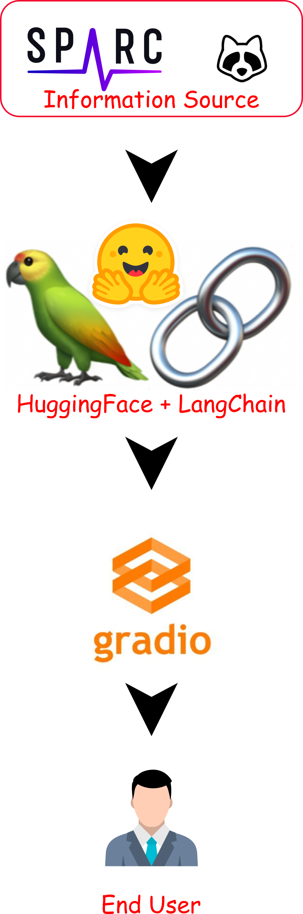
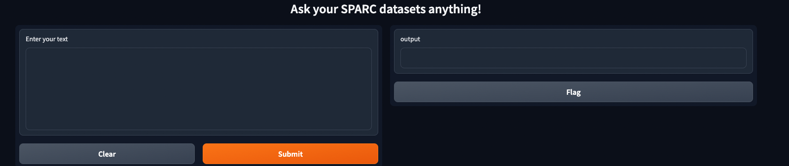

    
   
  <h3 align="center">
  Chat with SPARC datasets</h3>

<!-- TABLE OF CONTENTS -->

## Table of Contents

- [About](#about)
- [Problem Statement](#problem-statement)
- [Our Proposed Solution](#our-proposed-solution)
- [Workflow](#workflow)
- [Reporting issues](#reporting-issues)
- [FAIR practices](#fair-practices)
- [License](#license)
- [Team Members](#team-members)
- [Acknowledgements](#acknowledgements)

# About

This repository belongs to Team #5, **SPARC CHAT**, who took part in the [SPARC](https://commonfund.nih.gov/sparc) [Codeathon](https://sparc.science/news-and-events/events/2023sparc-codeathon/event-details) 2023. The project's concept and planning were collaboratively formulated by the team members during the event, reaching a mutual agreement.

# Problem Statement

For a new user, navigating unfamiliar resources like SPARC and its associated portals can be quite challenging, especially when trying to find specific information quickly. The process might involve extensive exploration, leading to significant time and effort being spent to acquire relevant information or datasets. In some cases, users may find themselves repeatedly searching for the same things in a never-ending loop. To achieve their purpose, users often need to search through various sections, projects, and pipelines, which can become a time-consuming task.

# Our Proposed Solution

The emergence of [OpenAI ChatGPT](https://chat.openai.com) marks a significant advancement in chatbot technology. This next-generation chatbot enables users to interactively and efficiently ask queries and receive relevant answers. However, it is essential to exercise caution while using it. OpenAI ChatGPT is a large language model (LLM) trained on extensive datasets gathered from the internet. Since its launch, numerous closed and [open-source](https://github.com/eugeneyan/open-llms) LLMs have also been released.

In this project, we leverage open-source LLMs and the available data on the SPARC portal to create a chatbot that assists users in finding the desired links and provides summaries of relevant information. Currently, the chatbot is limited to processing text-based information.

# Workflow

    

## Data

We gathered data from various pages of the **SPARC** portal, including the [SPARC Data & Models](https://sparc.science/data?type=dataset) page and other provided web links. For our model training, we randomly picked 12 datasets that contain valuable information related to related datasets, descriptions, abstracts, protocols, and other relevant details.

## Data pre-processing

## Model and Model Training

The collected data were preprocessed using [OpenAI ChatGPT](https://chat.openai.com/) and converted into prompts and answers. This data was used to train our models.

# Running the app

- Create a virtual environment `conda create -n chat`
- Activate the virtual environment `conda activate chat`
- Install requirements `pip install -r requirements.txt`
- Run the app `python app.py --hf_token <YOUR-HUGGING-FACE_TOKEN>`
- Open the app on your browser `http://127.0.0.1:7860`

You should see the Gradio interface running locally and you would be prompted to enter your query, like so:

# Troubleshooting

If you get issues with installing hnswlib, try installing it from source: `pip install git+https://github.com/nmslib/hnswlib.git`.

You may also need to run `export HNSWLIB_NO_NATIVE=1`. See this ongoing [Github thread](https://github.com/nmslib/hnswlib/issues/442) for the discussion.

# Reporting issues

Please report an issue or suggest a new feature using the [issue page](https://github.com/SPARC-FAIR-Codeathon/2023-team-5/issues). Check existing issues before submitting a new one.

# FAIR practices

Since the codeathon focused on FAIR data principles, **SPARC CHAT** also adheres to FAIR principles.

# Team Members

- [Alireza Moshayedi](https://github.com/alrzmshy) [Lead]
- [Lee Jia Lin](https://github.com/jlin95) [System Engineer]

- [Anmol Kiran](https://github.com/codemeleon) [Writer- Documentation]

# License

This code is licensed under the [MIT License](https://opensource.org/licenses/MIT).

- We can change it to another license if we need.

# Acknowledgements

We would like to thank the organizers of the **SPARC Codeathon 2023** for guidance and help during this Codeathon.

# ToDos

- [ ] FAIR practices statement for this project
